<h1 align="center">FinanceHub</h1>
Welcome to FinanceHub, python based online banking application where user can store his money, manipulate them, make a deposit or withdraw, change their pin and delete account

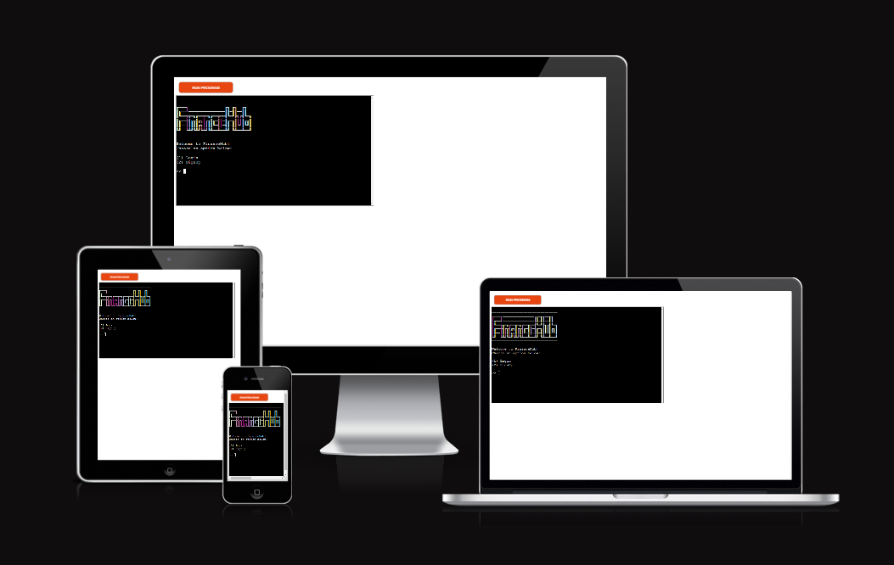

The FinanceHub is live, please [CLICK HERE](https://financehub0-076d71823038.herokuapp.com/) to check the website.

## Contents
---
* [**Project**](#project)
    * [User Abilities](#user-abilities)
        * [First Time Users](#first-time-user)
        * [Return Users](#return-users)

* [**User Experience**](<#user-experience-ux>)
    * [Site Structure](<#site-structure>)
    * [Data Model](<#data-model>)

* [**Features**](#features)
    * [Existing Features](<#existing-features>)
        * [Login](<#login>)
        * [SignUp](<#signup>)
        * [Account Main Page](<#1.-account-main-page>)
        * [Deposit Money](<#deposit-money>)
        * [Withdraw Amount](<#withdraw-amount>)
        * [PIN Change](<#pin-change>)
        * [Delete your Account](<#delete-your-account>)
        * [Logout](<#log-out>) 
    
* [**Technologies Used**](<#technologies-used>)
    * [Languages](<#languages-used>)
    * [Libraries](<#libraries-used>)
    * [Resources](<#resources>)
* [**Testing**](<#testing>)
    * [Validator Testing](<#validator-testing>)  
* [**Deployment**](<#deployment>)
    * [Heroku Deployment](<#heroku-deployment>)
    * [To Clone the Project](<#to-clone-the-project>)
* [**Credits**](<#credits>)
    * [Content](<#content>)
* [**Acknowledgements**](<#acknowledgements>)

## Project
---
### User Abilities
#### First Time User
A first time user can :
- Create an account
- Deposit some amount
- Log out.

#### Return Users
A return user can :
- Login to Account
- Check their Balance
- Change their PIN
- Withdraw amount
- Delete their account

[Back to top](<#contents>)

### User Experience (UX)

#### Site Structure
App has an entry page, where user can login to account or SignUp

- Login
- SignUp

After logging in the user continue at the main page of the app

- Deposit
- Withdraw Amount
- Change your PIN
- Delete  your Account

#### Data Model
Google sheets were used to store user data.There are only one page of google sheets:
 
 - for all users details

 The sheet with all users details contains:

 - Name
 - PIN
 - Balance

 [Back to top](<#contents>)

 #### Design

* Logo

The bank's logo is displayed on each page.

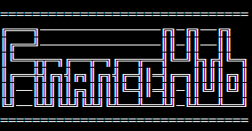

  ### FEATURES

  #### Existing Features
On the entry page user can decide if he wants to login or create a new account.

1. Login
2. SignUp

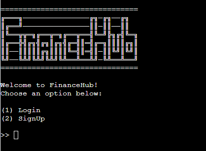

#### SignUp

If the user visited app for a first time, than he can create an account, he will be asked to create a unique username between 4 and 8 chars

- already existing username
- characters less than 4 and more than 8

After user got an username he will got automatically generated 4-digits pin:

- Date 
- Deposit
- Withdraw
- Balance

The username and PIN are displayed on the screen.

#### Login

All the users have to login to their account, if username and pin
provided by user are correct, main page will be loaded

#### 1. Account Main Page

The home page contains the following options:
    
0: Log out

1:Deposit money

2:Change my pin

3:Withdraw money

4:Delete my account

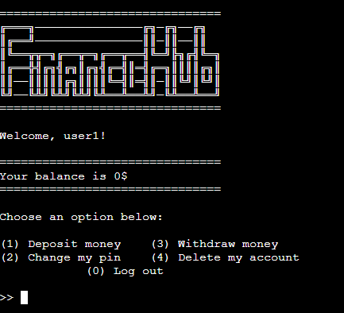

#### Deposit Money
---

The user can deposit any amount if the total amount is less than 100 billions

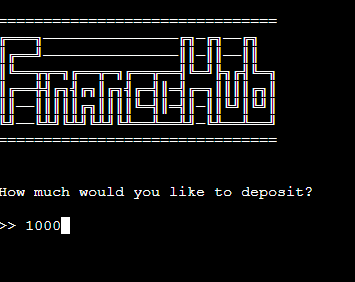

#### Withdraw Money
---
The user can withdraw any amount if he has enough money on his balance

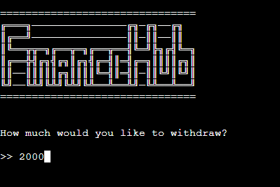

#### PIN Change
---
If the user wants to change his pin for some reason he can do it

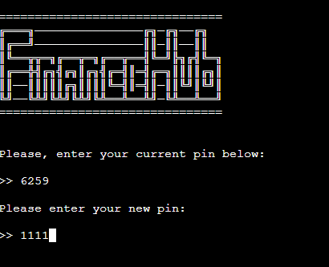

#### Delete your account
---
The user can delete his account and will be asked if he is sure

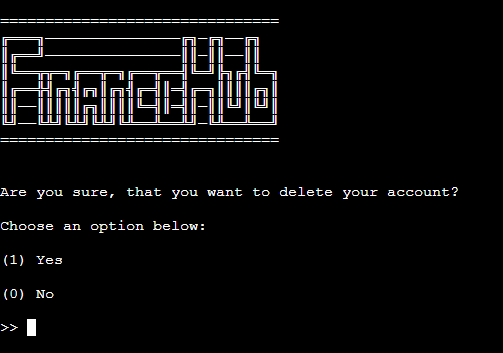

#### Log out
---
The user can log out from the main page by clicking '0'. Then he will be sent to entry page, to login or create a new account

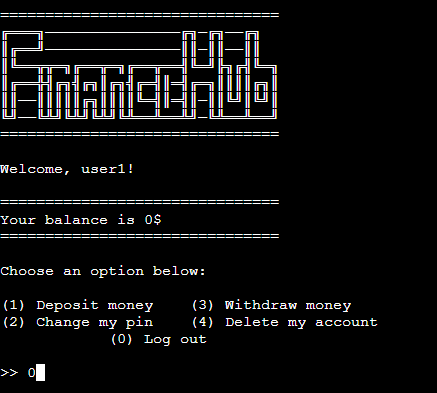

## Technologies Used
---
#### Languages used
- Python is used for the full funtionality of the website.

#### Libraries used
---

- [gspread](https://docs.gspread.org/en/v3.7.0/api.html) to link up the Google Sheet.
- [credentials](https://pypi.org/project/credentials/) to link the Google Sheet.
- [os](https://www.geeksforgeeks.org/clear-screen-python/) to clear the terminal.
- [time](https://www.programiz.com/python-programming/time/sleep) for the sleep function.
- [random](https://docs.python.org/3/library/random.html) to generate random pin

#### Resources
---

- [Github](<https://github.com/>) to store the code.
- [Heroku](<https://heroku.com/>)
- [Am I Responsive?](<https://ui.dev/amiresponsive>) for the display image across devices
- [W3 Schools](<https://www.w3schools.com/>) 
- [Google Sheets](<https://www.google.co.uk/sheets/about/>) to store user data

[Back to top](<#contents>)

## Testing

### Validator Testing
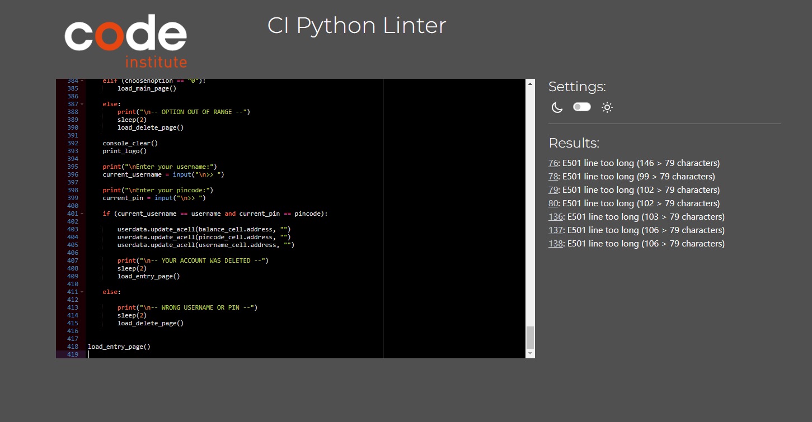

- No significant errors were found by PEP8 validator

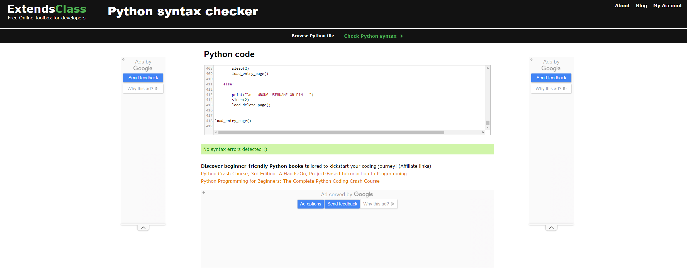

- No  errors found in python validator.

## Deployment
---
Git and GitHub were used for version control. As Python is a backend language and can't be displayed with GitHub Heroku was used for the live preview.

### Heroku Deployment
1. Login to Heroku
2. Click 'New' in the top right and 'Create new app'.
3. Enter a unique application name, select your region and click 'Create app'.
4. Click the 'settings' tab 
5. Under 'Config Vars' click 'Reveal Config Vars'
6. Add the JSPN CREDS file
7. Add PORT 8000
8. Add 'heroku/python' and 'heroku/node.js' to the 'Buildpacks'
9. Click the 'Deploy' tab.
10. In the 'Deployment method' section select 'GitHub'
11. Search for the repo name and click 'connect'
12. Under 'Automatic deploys' click 'Enable Automatic Deploys'

### To Clone the Project
To clone the project on GitHub:
1. Click the `code` button  
2. Click the `local` tab
3. Under HTTPS click the clipboard icon to copy the URL
4. In your IDE of choice, open Git Bash
5. Change the current working directory to the location where you want the cloned directory to be made
6. Type `git clone` and then paste the URL copied from GitHub
7. Press enter and the local clone will be created

[Back to top](<#contents>)

## Credits

### Content

The template for the readme was supplied by Code Institute

## Acknowledgements

- I would like to say thank you to my mentor Martina and my facilitator Marko which helped me allot through the project

[Back to top](<#contents>)

