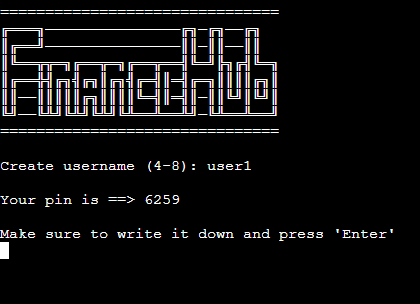

<h1 align="center">FinanceHub</h1>
Welcome to FinanceHub, python based online banking application where user can store his money, manipulate them, make a deposit or withdraw, change their pin and delete account

The FinanceHub is live, please [CLICK HERE](https://financehub0-076d71823038.herokuapp.com/) to check the website.

## Contents
---
* [**Project**](#project)
    * [User Stories](#user-stories)
        * [First Time Users](#first-time-user)
        * [Return Users](#return-users)

* [**User Experience**](<#user-experience-ux>)
    * [Site Structure](<#site-structure>)
    * [Data Model](<#data-model>)

* [**Features**](#features)
    * [Existing Features](<#existing-features>)
        * [Login](<#login>)
        * [SignUp](<#signup>)
        * [Account Main Page](<#1.-account-main-page>)
        * [Deposit Money](<#deposit-money>)
        * [Withdraw Amount](<#withdraw-amount>)

## Project
---
### User Stories
#### First Time User
A first time user can :
- Create an account
- Deposit some amount
- Log out.

#### Return Users
A return user can :
- Login to Account
- Check their Balance
- Change their PIN
- Withdraw amount
- Delete their account

[Back to top](<#contents>)

### User Experience (UX)

#### Site Structure
App has an entry page, where user can login to account or SignUp

- Login
- SignUp

After logging in the user continue at the main page of the app

- Deposit
- Withdraw Amount
- Change your PIN
- Delete  your Account

#### Data Model
Google sheets were used to store user data.There are only one page of google sheets:
 
 - for all users details

 The sheet with all users details contains:

 - Name
 - PIN
 - Balance

 [Back to top](<#contents>)

 #### Design

* Logo

The bank's logo is displayed on each page.

  ### FEATURES

  #### Existing Features
On the entry page user can decide if he wants to login or create a new account.

1. Login
2. SignUp

#### SignUp

If the user visited app for a first time, than he can create an account, he will be asked to create a unique username between 4 and 8 chars

- already existing username
- characters less than 4 and more than 8

After user got an username he will got automatically generated 4-digits pin:

- Date 
- Deposit
- Withdraw
- Balance

The username and PIN are displayed on the screen.

#### Login

All the users have to login to their account, if username and pin
provided by user are correct, main page will be loaded

#### 1. Account Main Page

The home page contains the following options:
    
0: Log out

1:Deposit money

2:Change my pin

3:Withdraw money

4:Delete my account

#### Deposit Money
---

The user can deposit any amount if the total amount is less than 100 billions

#### Withdraw Money
---
The user can withdraw any amount if he has enough money on his balance

